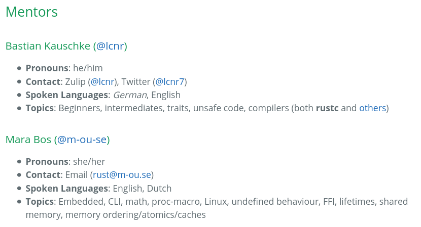

# Error Handling Isn't All About Errors

<span class=author>Jane Lusby</span>

<fab fa-twitter> [@yaahc_] / [yaah.dev]

Slide Template by Rebecca Turner <fab fa-twitter> [@16kbps] / [becca.ooo]

Notes: Hello and welcome to my talk, error handling isn't all about errors.

Next slide: Let me start by introducing myself...

<slide-footer>
<left>Jane Lusby (she/her)</left>
<right>
<fab fa-twitter> <a href="https://twitter.com/yaahc_">@yaahc_</a> / <a href="https://yaah.dev/">yaah.dev</a>
</right>
</slide-footer>

[@yaahc_]: https://twitter.com/yaahc_
[yaah.dev]: https://yaah.dev/
[@16kbps]: https://twitter.com/16kbps
[becca.ooo]: https://becca.ooo/

---

<slide class=center>

## About Me

Notes: My name is Jane Lusby, my pronouns are she/her. On the internet I go
by Yaah or Yaahc. I've been writing rust for two and a half years though I
was only recently hired to do so professionally, by The Zcash Foundation.


Next slide: Quick shameless plug, I also maintain `awesome-rust-mentors`...

---

<slide no-footer>

## Awesome Rust Mentors



Notes: Awesome-rust-mentors is a list of projects and people who are willing
to provide mentorship to anyone who asks. If you're interested in finding a
mentor, finding a project to get involved in, being a mentor, or getting
people involved in your project you should check it out.

---

## Why Error Handling?

Notes: I actually got into error handling on accident, it started as a yak
shave when I wanted to open source a library I wrote for work but I wasn't
happy with the error handling so I decided to fix it up first.

Next slide: That yak shave ended with me writing eyre...

---

## eyre


Notes: Eyre is a fork of anyhow with support for customized error reports via a
global hook, similar to a panic hook.

Next slide: I also ended up writing color-eyre.

---

## color-eyre


Notes: color-eyre is a library which provides a custom panic report hook and
a custom error report hook for eyre.

Next slide: With these libraries I'm now able to construct error reports like
this.

---

<pre class=term><font color="#CC0000"><b>❯</b></font> cargo run --example usage
<font color="#333333">Error:
   0: Unable to read config
   1: No such file or directory (os error 2)

  ━━━━━━━━━━━━━━━━━━━━━━━━━━━ SPANTRACE ━━━━━━━━━━━━━━━━━━━━━━━━━━━

   0: usage::read_file with path=&quot;fake_file&quot;
      at examples/usage.rs:32
   1: usage::read_config
      at examples/usage.rs:38

Suggestion: try using a file that exists next time

Backtrace omitted.
Run with RUST_BACKTRACE=1 environment variable to display it.
Run with RUST_BACKTRACE=full to include source snippets.</font></pre>

Notes: Here we can see the basic usage example.

Next slide: In it we have an error section.

---

<pre class=term><font color="#333333"><b>❯</b> cargo run --example usage</font>
Error:
   0: <font color="#F15D22">Unable to read config</font>
   1: <font color="#F15D22">No such file or directory (os error 2)</font>
<font color="#333333">
  ━━━━━━━━━━━━━━━━━━━━━━━━━━━ SPANTRACE ━━━━━━━━━━━━━━━━━━━━━━━━━━━

   0: usage::read_file with path=&quot;fake_file&quot;
      at examples/usage.rs:32
   1: usage::read_config
      at examples/usage.rs:38

Suggestion: try using a file that exists next time

Backtrace omitted.
Run with RUST_BACKTRACE=1 environment variable to display it.
Run with RUST_BACKTRACE=full to include source snippets.</font></pre>

Notes: Next slide: followed by a span trace section...


---

<pre class=term><font color="#333333"><b>❯</b> cargo run --example usage
Error:
   0: Unable to read config
   1: No such file or directory (os error 2)
</font>
  ━━━━━━━━━━━━━━━━━━━━━━━━━━━ SPANTRACE ━━━━━━━━━━━━━━━━━━━━━━━━━━━

   0: <font color="#F15D22">usage::read_file</font> with <font color="#34E2E2">path=&quot;fake_file&quot;</font>
      at <font color="#75507B">examples/usage.rs</font>:<font color="#75507B">32</font>
   1: <font color="#F15D22">usage::read_config</font>
      at <font color="#75507B">examples/usage.rs</font>:<font color="#75507B">38</font>
<font color="#333333">
Suggestion: try using a file that exists next time

Backtrace omitted.
Run with RUST_BACKTRACE=1 environment variable to display it.
Run with RUST_BACKTRACE=full to include source snippets.</font></pre>

Notes: If you're not familiar with tracing is this extremely cool
backtrace-like type of tracing spans.

Next slide: then after that we have a suggestion section


---

<pre class=term><font color="#333333"><b>❯</b> cargo run --example usage
Error:
   0: Unable to read config
   1: No such file or directory (os error 2)

  ━━━━━━━━━━━━━━━━━━━━━━━━━━━ SPANTRACE ━━━━━━━━━━━━━━━━━━━━━━━━━━━

   0: usage::read_file with path=&quot;fake_file&quot;
      at examples/usage.rs:32
   1: usage::read_config
      at examples/usage.rs:38
</font>
<font color="#34E2E2">Suggestion</font>: try using a file that exists next time
<font color="#333333">
Backtrace omitted.
Run with RUST_BACKTRACE=1 environment variable to display it.
Run with RUST_BACKTRACE=full to include source snippets.</font></pre>

Notes: Next slide: Followed finally by a omitted backtrace section

---

<pre class=term><font color="#333333"><b>❯</b> cargo run --example usage
Error:
   0: Unable to read config
   1: No such file or directory (os error 2)

  ━━━━━━━━━━━━━━━━━━━━━━━━━━━ SPANTRACE ━━━━━━━━━━━━━━━━━━━━━━━━━━━

   0: usage::read_file with path=&quot;fake_file&quot;
      at examples/usage.rs:32
   1: usage::read_config
      at examples/usage.rs:38

Suggestion: try using a file that exists next time
</font>
Backtrace omitted.
Run with RUST_BACKTRACE=1 environment variable to display it.
Run with RUST_BACKTRACE=full to include source snippets.</pre>

Notes: Next slide: I can also enable backtrace capture...

---

<pre class=term><b>❯</b> RUST_BACKTRACE=1 <font color="#333333">cargo run --example usage
// ...
  ━━━━━━━━━━━━━━━━━━━━━━━━━━━ BACKTRACE ━━━━━━━━━━━━━━━━━━━━━━━━━━━
                         ⋮ 5 frames hidden ⋮
   6: usage::read_file::h10b2389c2b814452
      at /home/jlusby/git/yaahc/color-eyre/examples/usage.rs:35
   7: usage::read_config::hf7150b146edb25d9
      at /home/jlusby/git/yaahc/color-eyre/examples/usage.rs:40
   8: usage::main::hc3df11a6ea0d044d
      at /home/jlusby/git/yaahc/color-eyre/examples/usage.rs:11
                        ⋮ 10 frames hidden ⋮
// ...
Run with RUST_BACKTRACE=full to include source snippets.</font></pre>

Notes: Next slide: Here we have a backtrace section...

---

<pre class=term><b>❯</b> <font color="#333333">RUST_BACKTRACE=1 cargo run --example usage
// ...</font>
  ━━━━━━━━━━━━━━━━━━━━━━━━━━━ BACKTRACE ━━━━━━━━━━━━━━━━━━━━━━━━━━━
  <font color="#34E2E2">                       ⋮ 5 frames hidden ⋮                       </font>
   6: <font color="#F15D22">usage::read_file</font><font color="#88807C">::h10b2389c2b814452</font>
      at <font color="#75507B">/home/jlusby/git/yaahc/color-eyre/examples/usage.rs</font>:<font color="#75507B">35</font>
   7: <font color="#F15D22">usage::read_config</font><font color="#88807C">::hf7150b146edb25d9</font>
      at <font color="#75507B">/home/jlusby/git/yaahc/color-eyre/examples/usage.rs</font>:<font color="#75507B">40</font>
   8: <font color="#F15D22">usage::main</font><font color="#88807C">::hc3df11a6ea0d044d</font>
      at <font color="#75507B">/home/jlusby/git/yaahc/color-eyre/examples/usage.rs</font>:<font color="#75507B">11</font>
  <font color="#34E2E2">                      ⋮ 10 frames hidden ⋮                       </font>
<font color="#333333">// ...
Run with RUST_BACKTRACE=full to include source snippets.</font></pre>

Notes: We can control the formatting of the backtrace section, here you can
see a pretty printed backtrace based on `color-backtrace`, which hides
irrelevant frames, in this case it's hidden 5 frames before read_file and 10
frames after main.

Next slide: we can take this further by applying custom filters...

---

<pre class=term><font color="#333333"><b>❯</b> RUST_BACKTRACE=1 cargo run --example custom_filter
// ...</font>
  ━━━━━━━━━━━━━━━━━━━━━━━━━━━ BACKTRACE ━━━━━━━━━━━━━━━━━━━━━━━━━━━
  <font color="#34E2E2">                       ⋮ 5 frames hidden ⋮                       </font>
   6: <font color="#F15D22">custom_filter::read_file</font><font color="#88807C">::h0afee8fe0960bf02</font>
      at <font color="#75507B">/home/jlusby/git/yaahc/color-eyre/examples/custom_filter.rs</font>:<font color="#75507B">53</font>
   7: <font color="#F15D22">custom_filter::read_config</font><font color="#88807C">::h6622065848c69b29</font>
      at <font color="#75507B">/home/jlusby/git/yaahc/color-eyre/examples/custom_filter.rs</font>:<font color="#75507B">58</font>
  <font color="#34E2E2">                      ⋮ 11 frames hidden ⋮                       </font>
<font color="#333333">// ...
Run with RUST_BACKTRACE=full to include source snippets.</font></pre>

Notes: Here you can see we've got 11 frames hidden after read_config instead
of 10 frames hidden after main because I've configured it to hide the main
frame.

Next slide: we can apply this custom filtering consistently to all of our
errors.

---

<pre class=term><font color="#CC0000"><b>❯</b></font> RUST_BACKTRACE=1 cargo run --example panic_hook --no-default-features
<font color="#CC0000">The application panicked (crashed).</font>
Message:  <font color="#06989A">No such file or directory (os error 2)</font>
Location: <font color="#75507B">examples/panic_hook.rs</font>:<font color="#75507B">37</font>

  ━━━━━━━━━━━━━━━━━━━━━━━━━━━ BACKTRACE ━━━━━━━━━━━━━━━━━━━━━━━━━━━
  <font color="#34E2E2">                      ⋮ 13 frames hidden ⋮                       </font>
  14: <font color="#F15D22">panic_hook::read_file</font><font color="#88807C">::h1a2c1d2710c16ca9</font>
      at <font color="#75507B">/home/jlusby/git/yaahc/color-eyre/examples/panic_hook.rs</font>:<font color="#75507B">37</font>
  15: <font color="#F15D22">panic_hook::read_config</font><font color="#88807C">::h2751dcca3305a9a3</font>
      at <font color="#75507B">/home/jlusby/git/yaahc/color-eyre/examples/panic_hook.rs</font>:<font color="#75507B">43</font>
  <font color="#34E2E2">                      ⋮ 11 frames hidden ⋮                       </font>

Run with COLORBT_SHOW_HIDDEN=1 environment variable to disable frame filtering.
Run with RUST_BACKTRACE=full to include source snippets.</pre>

Notes: So here you can see we can have the same report format for panics as
we did for our errors.

Next slide: with our error report hook we can also bundle arbitrary data with
our errors.

---

<slide no-footer>

<pre class=term><font color="#333333"><b>❯</b> cargo run --example custom_section
Error:
   0: the cat could not be got
   1: cmd exited unsuccessfully
</font>
Command:
   &quot;git&quot; &quot;cat&quot;

Stderr:
   git: &apos;cat&apos; is not a git command. See &apos;git --help&apos;.

   The most similar commands are
   	clean
   	mktag
   	stage
   	stash
   	tag
   	var

<font color="#333333">Suggestion: Maybe that isn&apos;t what git is for...</font></pre>

Notes: We can use this to make custom sections in our error reports. Here you
can see that in addition to the error section we also have a Command section
showing which command we tried to run and a stderr section, showing the
output of the command when it failed. And we'll dig into this example
more later, so look forward to that...

Next slide: and finally, we can also add errors as sections

---

<pre class=term><font color="#CC0000"><b>❯</b></font> cargo run --example multiple_errors
Error:
   0: <font color="#F15D22">encountered multiple errors</font>

Error:
   0: <font color="#F15D22">The task could not be completed</font>
   1: <font color="#F15D22">The task you ran encountered an error</font>

Error:
   0: <font color="#F15D22">The machine is unreachable</font>
   1: <font color="#F15D22">The machine you&apos;re connecting to is actively on fire</font>

Error:
   0: <font color="#F15D22">The file could not be parsed</font>
   1: <font color="#F15D22">The file you&apos;re parsing is literally written in c++ instead of rust, what the hell</font></pre>

Notes: Which we can use to aggregate multiple errors into a single report and
format them all consistently.


Now, I'm not giving this talk to talk about eyre and color-eyre.

Next slide: I'm giving this talk to share what I learned in that yak shave to
fix the error handling in my library that resulted in eyre and color-eyre,
and how the process has changed how I look at error handling and error
reporting.


---

## What Is Error Handling?

<list fragments>

- <del>Annoying</del>
- Defining errors
- Propagating errors and gathering context
- Reacting to specific errors
- Discarding errors
- Reporting errors and gathered context


Notes: Show the `annoying` bullet at the end of saying "What is error handling?".

don't mention the annoying, just keep going

It's lot of things, when you zoom in close. Error handling is defining
errors, with types and traits. It's propagating errors and gathering context,
and by context I mean stuff like the path you tried to open or a backtrace
showing where your error came from. It's reacting to specific errors, if the
file isn't found, create the file. It's discarding errors, and doing so
intentionally and visibly. And last but not least, it's reporting errors and
their associated context.

Now, this breakdown gets to the goal of my talk. I have a theory that error
handling is made more confusing by people try to simplify it, because, among
other things, error handling is annoying. I worry that the fuzziness between
these different responsibilities makes it hard for people to infer what tools
they should be using when "handling errors". My hope is that by breaking
error handling into it's component parts we can make it easier to understand
and explain.

Next slide: So let's start with the fundamentals. Note, this first bit is
taken almost word for word from The Rust Book's chapter on error handling.

---

<slide class=title-card data-state=purple>

# Recoverable<br> vs<br> Non-Recoverable

Notes: The Rust model for errors distinguishes between two classes of errors,
recoverable and non-recoverable errors.

Recoverable errors are errors that can reasonablly be reacted to, or reported
when encountered. These are errors like file not found, or connection closed.

Non-recoverable errors are errors that cannot reasonably be reacted to, only
reported, before exiting the thread or program. These errors are usually
caused by bugs such as index out of bounds or integer overflow.

Now, most languages dont distinguish between these kinds of errors.

For example, C++ has historically used exceptions for both.

Rust doesnt have exceptions, instead Rust has panic for non-recoverable
errors and result recoverable errors

---

## Panic

```rust []
// if the index is past the end of the slice
} else if self.end > slice.len() {
    panic!(
        "index {} out of range for slice of length {}",
        self.end,
        slice.len()
    );
}
```

Notes: non-recoverable errors in rust are created via the `panic!` macro.

Next slide: Here we can see an example of an index out of bounds error.

---

## Panic

```rust [4|5-6|1-8]
// if the index is past the end of the slice
} else if self.end > slice.len() {
    panic!(
        "index {} out of range for slice of length {}",
        self.end,
        slice.len()
    );
}
```

Notes: Only input for the panic macro is an error message and optionally
some context to include in that error message.

Reporting and default context gathering is done by panic hook, and by
default context gathering I mean capturing the caller location or capturing
the backtrace if it's enabled.

Once the panic hook is done printing the report the panic handler takes over
and cleans up either by unwinding the thread's stack or aborting the
application all together.

Next slide: Result

---

## Result

```rust [1-7|3-4|5-6|1-7|1]
#[must_use]
enum Result<T, E> {
    /// Contains the success value
    Ok(T),
    /// Contains the error value
    Err(E),
}
```

Notes: Recoverable errors in rust are modeled with the enum `Result<T, E>`.

This enum has two variants, Ok, which contains the value of an
operation when it completes successfully, and Err, which contains the error
value of an operation when it could _not_ be completed successfully.

We use Result to combine two return types in one and assign meaning to each
possibility.

In addition to this, Rust has marked the Result enum as `#[must_use]`, which
makes the compiler emit a warning whenever a result is discarded implicitly,
prompting us to discard it explicitly or otherwise handle it. This helps us
avoid ignoring errors accidentally and makes discarded errors visible to
later readers.

Next slide: The big advantage of using enums for recoverable errors is that
we must react to all errors.

---

## Result

```rust [1-4]
match result {
    Ok(success) => println!("we got the value {}!", success),
    Err(error) => println!("uh oh we got an error: {}", error),
}
```

Notes: Here you can see we have to use match (or anything equivalent to
match) to access the values inside of either variant.

With an enum, we cannot access the inner values without first accounting for
all the variants that enum could possibly be.

Next slide: Try and the try operator

---

## Try and `?`

Notes: The currently unstable try trait is used to model fallible return
types in rust. Indeed, Result is type that implements the Try trait, as does
Option, and other some combinations thereof.

Next slide: With the try trait rust is able to abstract the "propogation of
errors" with the try operator.

---

## Try and `?`

```rust left [1-4|8]
let config = match get_config() {
    Ok(success_value) => success_value,
    Err(error_value) => return Err(Error::from(error_value)),
};

// vs

let config = get_config()?;
```

Notes: Here we see two equivalent code snippets. The first manually
propagates the error using match and return. The second does the same by
simply using the try operator to propagate the error.

Next slide: Finally, The Error Trait.

---

## The Error Trait

<list fragments>

- Representing an open set of errors
- Reacting to specific errors in an open set
- Reporting Interface for all errors

Notes: The error trait fills three roles in rust.

First, it lets us represent an open set of errors by converting any type that
implements the error trait into an error trait object. This is important for
composing errors, and it is what lets us expose source errors via the error
trait regardless of their actual type.

Second, the error trait lets us then react to specific errors by trying to
downcast them back to their original type safely, rather than using match as
we would with enums.

Finally, it provides an interface for reporters.

Next slide: I'll get more into this last bit in a minute, but first let's review.

---

<slide no-footer>

<style>
.container{
    display: flex;
}
.col{
    flex: 1;
}
</style>

<div class="container">

<div class="col">
 Recoverable

<list fragments>

- Defining
  - types and traits
- Propagating
  - `?`
- Matching and Reacting
  - `match` or `downcast`
- Discarding
  - `drop` or `unwrap`
- Reporting
  - Error Trait

</div>

<div class="col">
Non-Recoverable

<list fragments>

- Defining
  - `panic!`
- Propagating
  - builtin
- Matching and Reacting
  - pls don’t
- Discarding
  - `catch_unwind`
- Reporting
  - panic hook

</div>

</div>

Notes: Okay so now we’ve covered the fundamentals, you know all the tools the
language and standard library give you to work with different kinds of
errors. Let see how these fit in to our original breakdown of the parts of
"error handling".

Next slide: Okay, so now we know all the fundemental tools built into the
language and where they fit into error handling. Next I'd like to dig into
the more complex ways you can compose these tools to write some Fancy Error
Reporting, but first let's set straight some terminology.

---

## Definitions

<list fragments>

- **Error**: A description of why an operation failed
- **Context**: Any information relevant to an error or an error report that
  is not itself an error
- **Error Report**: Printed representation of an error and all of its
  associated context

Notes: In the context of error reporting an error is ..., context is ..., and
an error report is the ...

Next slide: The concept of error reports and error reporters isn't a concept
that is common in the rust ecosystem today or any language's error handling
ecosystem as far as I know. However it is vocabulary that I find particularly
compelling in the context of rust error handling, and this is largely because
of how rust has defined it's error trait.

---

## The Error Trait

```rust [1-9|1|2-4|6-9]
pub trait Error: Debug + Display {
    fn source(&self) -> Option<&(dyn Error + 'static)> {
        None
    }

    fn backtrace(&self) -> Option<&Backtrace> {
        None
    }
}
```

Notes: Here is a simplified version of the error trait. Here you can see
we've got two super traits, debug and display, which we must impl to
implement the error trait. Then below that we have two functions, source and
backtrace, both with default impls that we can override when needed.

Next slide: Next lets look at a simple error

---

## The Error Trait - An Error

```rust [1-2|4|9|13]
#[derive(Debug)]
struct DeserializeError;

impl std::fmt::Display for DeserializeError {
    fn fmt(
        &self,
        f: &mut std::fmt::Formatter<'_>,
    ) -> std::fmt::Result {
        write!(f, "unable to deserialize type")
    }
}

impl std::error::Error for DeserializeError {}
```

Notes: Here we've got an error with no members. We derive debug on it, then
implement display, where we just write our error message and finally we impl
the error trait.

We don't have a source or a backtrace, so we don't need to override any
functions here, which is why the block on the trait implementation is empty.
If we did have a source though we would need to override the `source`
function in order to return a reference to our source as an error trait
object.

Next slide: finally lets look at a simple error reporter.

---

## The Error Trait - A Reporter

```rust [1|4-9|11-13|1-14]
fn report(error: &(dyn std::error::Error + 'static)) {
    print!("Error:");

    let errors =
        std::iter::successors(Some(error), |e| e.source());

    for (ind, error) in errors.enumerate() {
        print!("\n   {}: {}", ind, error);
    }

    if let Some(backtrace) = error.backtrace() {
        print!("\n\nBacktrace: {}", backtrace);
    }
}
```

Notes: Here we've implemented our reporter as a short free function. This
function takes an error and prints that error and all of its sources,
followed by a backtrace if our error captured one. A more complex error
reporter might also try to check all errors for a backtrace, or if it were a
type and was storing its own context in addition to the error it might print
that as well.

Next slide: In other languages there is no distinction between errors and
reporters, and this is largely due the lack of an equivalent to the Error
Trait.

---

## The Error Trait

```rust []
trait GoError {
    fn msg(&self) -> String;
}

trait CppError {
    fn msg(&self) -> &'spooky str;
}
```

Notes: The error trait equivalent in other languages is often quite simple,
just a single fn to grab the error message.

These interfaces force you to either include your source error, your
backtrace, and any other information you care about in your error message or
to avoid using the provided interface all together.

In rust we don't have to combine our messages all into one, in fact, you're
encouraged not to. Including a source error's message in your `Display`
implementation and returning it as your source via the Error trait is
essentially a bug, as it forces reporters to duplicate information when they
print out the chain of error messages.

Next slide: By separating the source and the error message we move the
responsibility of formatting away from the errors themselves, making it
possible to get fancy.

---

## The Error Trait

<slide no-footer>

<pre class=term><font color="#CC0000">ERROR</font> <b>read_config</b>:<b>read_file{</b>path=&quot;fake_file&quot;<b>}</b>: Error: Unable
to read config: No such file or directory (os error 2)
<font color="#333333">
// vs

Error:
   0: Unable to read config
   1: No such file or directory (os error 2)

  ━━━━━━━━━━━━━━━━━━━━━━━━━━━ SPANTRACE ━━━━━━━━━━━━━━━━━━━━━━━━━━━

   0: usage::read_file with path=&quot;fake_file&quot;
      at examples/usage.rs:52
   1: usage::read_config
      at examples/usage.rs:58</font></pre>

Notes: In rust we can have the same error print to a log as one line, but the
terminal as many.

This wouldn't be possible if the error trait didn't separate the error
message from other context such as the source error.

Next slide: However, despite the fact that the error trait in rust is more
flexible than most other languages, it is still restrictive in some ways.

---

## The Error Trait
<slide no-footer>

<pre class=term><font color="#333333">ERROR <b>read_config</b>:<b>read_file{</b>path=&quot;fake_file&quot;<b>}</b>: Error: Unable
to read config: No such file or directory (os error 2)

// vs
</font>
Error:
   0: <font color="#F15D22">Unable to read config</font>
   1: <font color="#F15D22">No such file or directory (os error 2)</font>

  ━━━━━━━━━━━━━━━━━━━━━━━━━━━ SPANTRACE ━━━━━━━━━━━━━━━━━━━━━━━━━━━

   0: <font color="#F15D22">usage::read_file</font> with <font color="#34E2E2">path=&quot;fake_file&quot;</font>
      at <font color="#75507B">examples/usage.rs</font>:<font color="#75507B">52</font>
   1: <font color="#F15D22">usage::read_config</font>
      at <font color="#75507B">examples/usage.rs</font>:<font color="#75507B">58</font></pre>

Notes: In rust we can have the same error print to a log as one line, but the
screen as many.

This wouldn't be possible if the error trait didn't separate the error
message from other context such as the source error.

Next slide: However, despite the fact that the error trait in rust is more
flexible than most other languages, it is still restrictive in some ways.

---

## The Error Trait
<slide no-footer>

<pre class=term><font color="#CC0000">ERROR</font> <b>read_config</b>:<b>read_file{</b>path=&quot;fake_file&quot;<b>}</b>: Error: Unable
to read config: No such file or directory (os error 2)

// vs

Error:
   0: <font color="#F15D22">Unable to read config</font>
   1: <font color="#F15D22">No such file or directory (os error 2)</font>

  ━━━━━━━━━━━━━━━━━━━━━━━━━━━ SPANTRACE ━━━━━━━━━━━━━━━━━━━━━━━━━━━

   0: <font color="#F15D22">usage::read_file</font> with <font color="#34E2E2">path=&quot;fake_file&quot;</font>
      at <font color="#75507B">examples/usage.rs</font>:<font color="#75507B">52</font>
   1: <font color="#F15D22">usage::read_config</font>
      at <font color="#75507B">examples/usage.rs</font>:<font color="#75507B">58</font></pre>

Notes: In rust we can have the same error print to a log as one line, but the
screen as many.

This wouldn't be possible if the error trait didn't separate the error
message from other context such as the source error.

Next slide: However, despite the fact that the error trait in rust is more
flexible than most other languages, it is still restrictive in some ways.

---

## The Error Trait is restrictive

<list fragments>

- Can only represent errors with a single source
- Can only access 3 forms of context

Notes: The error trait can only represent errors with a single source.

If you've ever written a parser you might have run into this, where you have
multiple syntax errors at once. The error trait can only represent a chain of
errors as a singly linked list, and so it doesn't work well for domains like
parsers where the error causes end up looking more like a tree.

In addition, you can only access 3 forms of context via the error trait.

Can't return types like SpanTrace or a `Location` without using hacks based
on downcast to work around the error trait.

Next slide: This prevents us from having things like Error return traces.

---

## Error Return Traces

```console
Error:
    0: ERROR MESSAGE
        at LOCATION
    1: SOURCE'S ERROR MESSAGE
        at SOURCE'S LOCATION
    2: SOURCE'S SOURCE'S ERROR MESSAGE
    ...
```

Notes: I dream of a rust where reporters can access things like the location
an error was constructed, HTTP status codes, custom report sections, and
more. If we could access generic forms of context in error reporters we could
implement error return traces and much much more.

Now, I do have plans on how we can fix these problems though, so in the
future this may no longer be an issue.

Next slide: Okay, so I think y'all have a vague idea of what an error
reporter is now. so let's dig into an example of how to use one real quick by
recreating the custom_section example from the beginning of the talk.


---

```rust [1-3|5|7|9-10|12|13|15]
trait CommandExt {
    fn output2(&mut self) -> Result<String, eyre::Report>;
}

impl CommandExt for std::process::Command {
    fn output2(&mut self) -> Result<String, eyre::Report> {
        let output = self.output()?;

        let stdout = String::from_utf8_lossy(&output.stdout)
            .into_owned();

        if output.status.success() {
            Ok(stdout)
        } else {
            Err(eyre!("command exited unsuccessfully"))
        }
    }
}
```
Notes: lets create a custom version of the `Command::output` funtion with a
nicer to use interface. Instead of returning an `Output` type with stderr and
stdout as vecs of bytes and an `ExitStatus` lets return just a string for
stdout if the command succeeds, and return an eyre::Report if the command
fails.

Next slide: lets run it...

---

<pre class=term><font color="#CC0000"><b>❯</b></font> cargo run
Error:
   0: <font color="#F15D22">command exited unsuccessfully</font></pre>

Notes: We got our error report with our error message, cool! But also not
very helpful, I didn't even show you main or tell you what command I was
running. Lets figure that out next.

---

```rust [10|13]
impl CommandExt for std::process::Command {
    fn output2(&mut self) -> Result<String, eyre::Report> {
        let output = self.output()?;

        let stdout = String::from_utf8_lossy(&output.stdout).into_owned();

        if output.status.success() {
            Ok(stdout)
        } else {
            let cmd = format!("{:?}", self);

            Err(eyre!("command exited unsuccessfully"))
                .section(cmd.header("Command:"))
        }
    }
}
```

Notes: So first we format the command to a string, then we shove that into
the eyre report as a section with an added header. These functions, section
and header, are provided by color-eyre, and they all just work with any types
that implement display.

Next slide: so lets see how this changes things...

---

<pre class=term><font color="#CC0000"><b>❯</b></font> cargo run
Error:
   0: <font color="#F15D22">command exited unsuccessfully</font>

Command:
   &quot;git&quot; &quot;cat&quot;</pre>


Notes: Here we can see why the command failed, cat isn't a real git command!
It would be cool if it was though.

Next slide: Now, this error isn't very descriptive. Sure, it describes what
went wrong, but it is far too generic. Let's go ahead and define a new error
with a more descriptive error message to wrap our source error.

---

```rust left []
fn main() -> Result<(), eyre::Report> {
    color_eyre::install()?;

    let _ = std::process::Command::new("git")
        .arg("cat")
        .output2()?;


    Ok(())
}
```

---

```rust left [7]
fn main() -> Result<(), eyre::Report> {
    color_eyre::install()?;

    let _ = std::process::Command::new("git")
        .arg("cat")
        .output2()
        .wrap_err("the cat could not be got")?;

    Ok(())
}
```

Notes: SPEAK SLOWLY: This function takes a Result and an arg that implements
Display, and if the Result is the `Err` variant it creates a new error, using
the arg as the error message and the old error as the source. It then returns
this new error as an eyre::Report.

---

<pre class=term><font color="#CC0000"><b>❯</b></font> cargo run
Error:
   0: <font color="#F15D22">the cat could not be got</font>
   1: <font color="#F15D22">command exited unsuccessfully</font>

Command:
   &quot;git&quot; &quot;cat&quot;

</pre>

---

```rust [7-9|13-14]
        let stdout = String...

        if output.status.success() {
            Ok(stdout)
        } else {
            let cmd = format!("{:?}", self);
            let stderr =
                String::from_utf8_lossy(&output.stderr)
                    .into_owned();

            Err(eyre!("command exited unsuccessfully"))
                .section(cmd.header("Command:"))
                .section(stdout.header("Stdout:"))
                .section(stderr.header("Stderr:"))
        }
    }
}
```

---

<pre class=term><font color="#4E9A06"><b>❯</b></font> cargo run
Error:
   0: <font color="#F15D22">the cat could not be got</font>
   1: <font color="#F15D22">command exited unsuccessfully</font>

Command:
   &quot;git&quot; &quot;cat&quot;

Stderr:
   git: &apos;cat&apos; is not a git command. See &apos;git --help&apos;.

   The most similar commands are
   	clean
   	mktag
   	stage
   	stash
   	tag
   	var</pre>

Notes: And finally we have an error report including all the information we
need. With it we can pinpoint what went wrong, why it went wrong, and, as an
added bonus, how we can fix it.

Hopefully this makes it clear how benefitial just a little context can be for
error reports, and helps you understand why I think error reporting is such
an important concept. And this is just what I've
configured the hooks from color-eyre to support, you can do much more if you
take the time to write your own hooks. I don't have time to go into details
on how to customize eyre as part of this talk but if you're interested in
learning more please check out my blog.

---

## TIPS - Reporters

<list fragments>

- Reporters almost always impl `From<E: Error>`
- if they do they _cannot_ impl `Error`
    - `anyhow::Error`
    - `eyre::Report`
    - `Box<dyn Error>`
- don't compose well

Notes: Before I go on I've got some tips related to error reporters that I
think are useful to know.

Reporters exist to generically format any error and they're built on
the error trait, so it makes sense that we'd want an interface to create one
from any error.

Now, as a consequence of this they cannot implement the error trait. This is
true of all types that implement `from<E>`, including `Box<dyn Error>`.
Implementing both of these traits ends up violating the overlap rule, in that
there would be two From impls to choose from when converting a reporter to
itself.

Thanks to the fact they cannot implement the error trait, they also don't
compose well. This is just one of many reasons reporters aren't good to use
in library APIs, because your users will have to jump through extra hoops to
use them as sources for other errors.

Next slide: By now you should know all the tools built into the language, how
they fit into the various pieces of error handling, and have an understanding
of how they can be combined to write error reports. So finally, I'd like to
look at the ecosystem at large to see what open source libraries we can use
to help us with our five parts of error handling.

---

## Libraries

- Defining
- Propagating and Gathering Context
- Matching and Reacting
- Discarding
- Reporting

Notes: quick reminder, heres our breakdown. I'm going to introduce these
libraries by how they fit into our error handling breakdown, not every part
will have libraries to help and some will be disproportionately represented.

Next slide: First I'd like to introduce thiserror.

---

## Defining - thiserror

``` rust []
#[derive(Debug)]
pub enum DataStoreError {

    Disconnect(io::Error),

    Redaction(String),

    InvalidHeader {
        expected: String,
        found: String,
    },
}
```

Notes: Thiserror is an error derive macro, and it exists to reduce boiler
plate by implementing commonly used traits for you, such as Error, Display,
and From.

---

## Defining - thiserror

``` rust []
#[derive(Debug, thiserror::Error)]
pub enum DataStoreError {

    Disconnect(io::Error),

    Redaction(String),

    InvalidHeader {
        expected: String,
        found: String,
    },
}
```

Notes: To use it, we start by adding the macro's identifier to our derive
attribute.

---

## Defining - thiserror

``` rust [1-14|3|5|7|4]
#[derive(Debug, thiserror::Error)]
pub enum DataStoreError {
    #[error("data store disconnected")]
    Disconnect(io::Error),
    #[error("the data for key `{0}` is not available")]
    Redaction(String),
    #[error("invalid header (expected {expected:?}, found {found:?})")]
    InvalidHeader {
        expected: String,
        found: String,
    },
}
```

Notes: Next, we implement display with `thiserror` via `error` attributes.

We can have a simple attribute which contains only a string literal.

We can also include variables into our error messages with thiserror's custom
format syntax, for both unnamed and named members.

thiserror can also handle implementing our source and backtrace
functions for us. HIT NEXT

Any member with the name `source` or `backtrace` will automatically be
returned from the appropriate function, or this can also be done explicitly
by using the `#[source]` attribute.

---

## Defining - thiserror

``` rust [4]
#[derive(Debug, thiserror::Error)]
pub enum DataStoreError {
    #[error("data store disconnected")]
    Disconnect(#[source] io::Error),
    #[error("the data for key `{0}` is not available")]
    Redaction(String),
    #[error("invalid header (expected {expected:?}, found {found:?})")]
    InvalidHeader {
        expected: String,
        found: String,
    },
}
```

Notes: Thiserror can also implement From with the `#[from]` attribute.

---

## Defining - thiserror

``` rust [4|1-14]
#[derive(Debug, thiserror::Error)]
pub enum DataStoreError {
    #[error("data store disconnected")]
    Disconnect(#[from] io::Error),
    #[error("the data for key `{0}` is not available")]
    Redaction(String),
    #[error("invalid header (expected {expected:?}, found {found:?})")]
    InvalidHeader {
        expected: String,
        found: String,
    },
}
```

Notes: Note that this also implies the `#[source]` attribute when used. HIT NEXT

And this isn't all thiserror can do, so please check out the documentation
for more details.

Next slide: Next I'd like to introduce `displaydoc`

---

## Defining - displaydoc

```rust []
#[derive(Debug, thiserror::Error, displaydoc::Display)]
pub enum DataStoreError {
    /// data store disconnected
    Disconnect(#[from] io::Error),
    /// the data for key `{0}` is not available
    Redaction(String),
    /// invalid header (expected {expected:?}, found {found:?})
    InvalidHeader {
        expected: String,
        found: String,
    },
}
```

Notes: Displaydoc is a fork of thiserror that provides only the display
derive portion of thiserror, but uses doc comments instead of custom
attributes to input the format strings. I find this is great for simple error
types and that often error messages make for great documentation.

Next slide: Now I'd like to move onto SNAFU

---

## Defining Errors & Gathering Context - SNAFU


```rust [1-13|1|2-4|10-11]
#[derive(Debug, Snafu)]
enum Error {
    #[snafu(display("Unable to read configuration from {}: {}", path.display(), source))]
    ReadConfiguration { source: io::Error, path: PathBuf },
}

fn process_data() -> Result<(), Error> {
    let path = "config.toml";
    let configuration = fs::read_to_string(path)
        // wrap error while capturing `path` as context
        .context(ReadConfiguration { path })?;
    Ok(())
}
```
Notes: Snafu is another error derive macro, much like thiserror. We use it
the same way, we add the macro to our derive attribute, and we use some
custom attributes to implement display. The main difference is that snafu
also has a special helper function called `context` to further reduce
boilerplate when capturing context for error messages.

The context function takes a result and a "Context Selector" struct which is
autogenerated by the derive macro. You may notice that the source member is
missing here. This is because the `context` function implicitly passes along
context like the source and backtrace, making it so you only have to capture
additional context that is unique that your error variant. It then internally
creates the correct wrapping error variant. You can think of it as syntax
sugar for `map_err`.

---

## Defining - anyhow/eyre

```rust []
// Construct an ad-hoc error
Err(eyre!("file not found"))?

// Constructing an ad-hoc wrapping error
fallible_fn()
    .wrap_err("failed operation")?;
```

Notes: anyhow and eyre also have helpers for defining new errors. However,
these functions don't help you define new error types, instead they use their
own private types to create the new errors and then immediately convert those
errors to their error reporting type. This is mostly useful for when you want
to create errors exclusively to report them, a common need when writing
applications, though these crates do also provide some helpers for then later
reacting to these adhoc error types.

---

## TIPS - Defining

- API stability
- Stack Size

Notes: Before we continue there are some things I'd like to share that I
think are useful to know when defining errors.

---

## API Stability

```rust []

#[derive(Debug, Display, Error)]
pub enum Error {
    /// Could not deserialize type

    Deserialize{
        source: io::Error,
    },
}
```

Notes: API stability is an easy pitfall to run into as a library author. If
you just create a public enum for your error type adding a new variant or
even a new member to an existing variant is a breaking change. This can be
avoided simply by adding `#[non_exhaustive]` to error enums where you think
you may wish to add new variants in the future, or to specific variants where
you think you may want to add new members in the future.

---

## API Stability

```rust []
#[non_exhaustive]
#[derive(Debug, Display, Error)]
pub enum Error {
    /// Could not deserialize type

    Deserialize{
        source: io::Error,
    },
}
```

Notes: API stability is an easy pitfall to run into as a library author. If
you just create a public enum for your error type adding a new variant or
even a new member to an existing variant is a breaking change. This can be
avoided simply by adding `#[non_exhaustive]` to error enums where you think
you may wish to add new variants in the future, or to specific variants where
you think you may want to add new members in the future.

---

## API Stability

```rust []
#[non_exhaustive]
#[derive(Debug, Display, Error)]
pub enum Error {
    /// Could not deserialize type
    #[non_exhaustive]
    Deserialize{
        source: io::Error,
    },
}
```

Notes: API stability is an easy pitfall to run into as a library author. If
you just create a public enum for your error type adding a new variant or
even a new member to an existing variant is a breaking change. This can be
avoided simply by adding `#[non_exhaustive]` to error enums where you think
you may wish to add new variants in the future, or to specific variants where
you think you may want to add new members in the future.

---

## Stack Size

```rust [1-11|3-11]
struct LargeError { ... }

///     /!\ Doesn't impl Error /!\
fn fallible_fn() -> Result<(), Box<dyn Error>> {
    // ...
}

///         Does impl Error !!! \o/
fn fallible_fn() -> Result<(), Box<LargeError>> {
    // ...
}
```

Notes: It's also important to consider stack size when handing errors. With Result
the size of your return type is the larger of the two variants. If your error
types are large all functions returning your errors will require more stack
space. This can negatively impact the performance of your program even when
no errors are encountered. The solution here is to allocate your errors on
the heap when they're too large, either with a Box or reporting type like
eyre / anyhow which are designed to occupy as little stack space as possible.
However, when boxing errors remember to use the original error type and not
dyn error, so that the Box still implements the Error trait.

Next slide: Okay, enough with the tips, lets move on to propagation and
gathering context. Starting with `fehler`.

---

## Propagating - fehler

```rust [1-8|2|1|4|6]
#[fehler::throws(i32)]
fn foo(x: bool) -> i32 {
    if x {
        0
    } else {
        fehler::throw!(1);
    }
}
```

Notes: Fehler is library that adds support for "throwing functions" to rust
through procedural macros. Functions annotated with `throws` return Result,
where the Ok type is the apparent return type on the function and the Err
type is listed in the throws attribute. It does implicit Ok wrapping for
return types and provides a throws macro for returning error types. If you're
missing throws syntax in rust this is the library for you.

Next slide: next, for gathering context I'd like to introduce tracing-error.

---

## Gathering Context - tracing-error

```rust [1-9|1-3|5-9]
// instrument the error
let error = std::fs::read_to_string("myfile.txt")
    .in_current_span();

// extract it from `dyn Error`
let error: &(dyn std::error::Error + 'static) = &error;
assert!(error.span_trace().is_some());
```

Notes: Tracing error is the tracing instrumentation library that exposes the
`SpanTrace` type. This library also has some cool helpers for wrapping errors
with SpanTraces and then later extracting them through `dyn Error` trait
objects, working around one of the restrictions of the error trait.

Here we use `in_current_span` to wrap an error with our Instrumented error
type, then below that we convert that error immediately to a trait object and
then extract the spantrace from that error using some clever hacks.

---

## Gathering Context - extracterr

```rust [1-11|1-2|4-5|7|9-11]
#[derive(Debug, Display, Error)]
struct ExampleError;

type Error =
    extracter::Bundled<ExampleError, backtrace::Backtrace>;

let error = Error::from(ExampleError);

// extract it from `dyn Error`
let error: &(dyn std::error::Error + 'static) = &error;
assert!(error.extract::<backtrace::Backtrace>().is_some());
```

Notes: extracterr is an abstraction of the helpers written in `tracing-error`
for SpanTraces. Instead extracterr exposed a `Bundled` type for bundling
arbitrary types with errors which can then be extracted later through `dyn
Error` trait objects. Here is an example of `Bundled` being used to bundle a
`Backtrace-rs` backtrace with an error, emulating the `backtrace()` fn on the
error trait in a way that works on stable today.

---

## Matching and Reacting - anyhow/eyre

```rust [1-9|1-3|6|9]
#[derive(Display)]
/// Random error message
struct FooMessage;

let report = fallible_fn()
    .wrap_err(FooMessage)
    .unwrap_err();

assert!(report.downcast_ref::<FooMessage>().is_ok());
```

Notes: I mentioned this earlier, but anyhow and eyre also have some helpers
for handling their own adhoc created errors. Errors created with the `eyre`
macro or with `wrap_err` can be downcast back to the original type used to
construct the adhoc error.

---

## Discarding

- Nothing

Notes: I don't know of any open source libraries for helping with discarding
errors, but if you do please let me know.

---

## Reporting

<list fragments>

- Reporters: anyhow/eyre
- Hooks: color-eyre, stable-eyre, jane-eyre, color-anyhow (soon)

Notes: For reporting you're already familiar with anyhow and eyre, given that
they're the star of this talk. These libraries expose error reporters that
are, as far as I can tell, strictly superior versions of `Box<dyn Error>`.

For customizing these reporters there are a couple of hook libraries I've
written. Color-eyre you're already familiar with. stable-eyre provides
identical features to the default hook provided by eyre, but using the
`backtrace-rs::Backtrace` instead of the `std::Backtrace`, so it works on
stable. Jane-eyre is just a re-export of color-eyre but I think its worth a
mention just for the pun, given that its the reason I named my library eyre.
color-anyhow isn't usable yet but the PR to add reporting hooks to anyhow has
already been written and looks likely to merge as soon as I've gathered
enough evidence to prove the design, so please look forward to that in the
future if you're already using anyhow.

---

## Library vs Application

<list fragments>

- Library => error defining libraries or by hand
- Application => adhoc error defining + error reporting libraries

Notes: So thats it, that's everything I wanted to tell you. But before we go
I'd like to try applying this breakdown of error handling idea to a question
I see all the time in the rust community. What library do I use when writing
errors?

The common answer to this question that you'll see time and again is "use
anyhow for applications and use thiserror for libraries". Now, I agree that
this is usually correct, but it's not universally true, we can come up with a
better rule of thumb if we ask ourselves what kinds of error handling do we
need for libraries vs applications.

For libraries, we generally don't know how our users will handle our errors.
They could report, react, wrap and propagate them, or discard them. So we
need errors that are maximally flexible, this means we need to impl Error so
they can compose with other errors and be reported and we want our error to
be an enum so it can be reacted to easily. We want our API to be stable, so
we want an open set with `#[non_exhaustive]` so we can addition errors in the
future. All of this pushes us to use error defining libraries like derive
macros or to just implement the associated traits by hand.

For applications on the other hand, we know which errors we're going to
handle vs report, and we usually handle them close to where they're returned.
We will need to create new errors, but usually this is only for errors we
wish to report. And we need to be able to report arbitrary errors, because
applications usually work with errors from many sources. All of this pushes
us to use an error reporting library like `eyre` and `anyhow`.

---

# Fin

Notes: And that's it, for real this time, thats the entire talk! Thank you
everyone for taking the time to listen, I hope you've found it helpful.